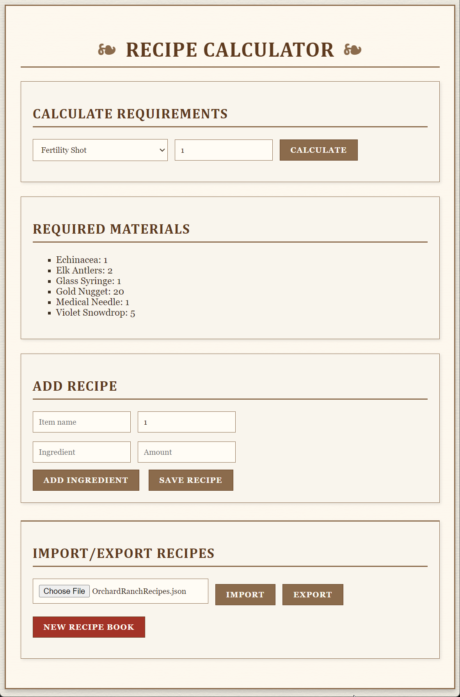

# Recipe Calculator

This application helps manage and calculate recipes with a historical aesthetic.

## Download

To use Recipe Calculator:

1. Go to the [Releases](https://github.com/yourusername/recipe-calculator/releases) page
2. Download the latest version for Windows
3. Extract the ZIP file (if necessary)
4. Run `recipe-calculator.exe` to start the application

No installation required - the application runs directly from the executable file.

## Features

- Calculate ingredient quantities based on batch size
- Save and load recipes
- Portable application - no installation needed

## How to Use

1. **Creating a New Recipe**:
   - Click "New Recipe" and enter a recipe name
   - Add ingredients with their quantities
   - Save your recipe using the "Save" button

2. **Loading Existing Recipes**:
   - Use the "Load" button to open previously saved recipes
   - Select a recipe from the list to view or edit

3. **Scaling Recipes**:
   - Enter the desired batch size in the scaling field
   - The application will automatically recalculate all ingredient quantities

4. **Exporting Recipes**:
   - Use the "Export" button to save recipes as printable documents

## System Requirements

- Windows 10 or later

## Support

If you encounter any issues or have questions, please [open an issue](https://github.com/yourusername/recipe-calculator/issues) on this repository.

## License

[MIT](LICENSE)

## For Developers

If you're interested in working with the source code:

1. Clone the repository: `git clone https://github.com/yourusername/recipe-calculator.git`
2. Install dependencies: `npm install`
3. Start the development version: `npm start`
4. Package the application: `npm run package`

The application is built with Electron and uses standard web technologies (HTML, CSS, JavaScript).

